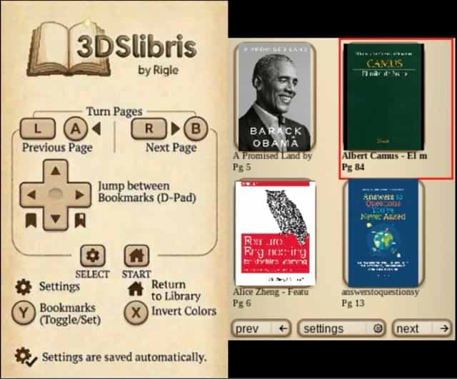
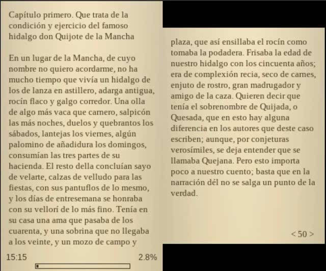

<h1>
  
  3dslibris
</h1>

[](https://github.com/RigleGit/3dslibris/releases)
[](https://github.com/RigleGit/3dslibris/actions/workflows/ci.yml)

Nintendo 3DS homebrew ebook reader based on the original Nintendo DS project `dslibris`.

`3dslibris` ports the original architecture to `libctru`, keeps the fast text-first reading model, and adds practical 3DS UX improvements (grid library, cover thumbs, indexed navigation, procedural UI skin, orientation-aware touch, etc.).

The current `.cia` packaging flow is based on the same `makerom`/`bannertool` process used by [Universal-Updater](https://github.com/Universal-Team/Universal-Updater), adapted to this project's assets and release layout.

<table>
  <tr>
    <td width="50%"></td>
    <td width="50%"></td>
  </tr>
</table>

## Project status
- Current app version: `1.0.3`
- Focus: stable daily reading on 3DS hardware and Citra/Azahar
- Repository status: public release available and under active maintenance
- Latest downloadable binaries and SD package: [GitHub Releases](https://github.com/RigleGit/3dslibris/releases)
- Releases also include `3dslibris-debug.3dsx`, which enables verbose diagnostic logging in `3dslibris.log`
- Supported install paths: `.3dsx` plus `3dslibris-sdmc.zip`, or `3dslibris.cia`

## Supported formats

### Strong support
- `EPUB` (EPUB2 + EPUB3 NAV/NCX parsing with robust fallbacks)

### Good support (text-oriented)
- `FB2`
- `TXT`
- `RTF`
- `ODT`

### Experimental / best-effort
- `MOBI`
  - First open can be slow on large books (decompress + parse + pagination)
  - Subsequent opens are accelerated by persistent page cache
  - TOC quality is heuristic for many files (can be approximate)
  - Includes an optional per-book `line wrap fix` for badly converted files that hard-wrap prose line by line
  - Empty or corrupt books are reported with a readable error instead of a raw numeric code

## Known limitations
- Some EPUB files have malformed anchors; index jumps can be approximate when source metadata is broken.
- MOBI TOC extraction depends on file structure and may omit or merge entries in some books.
- Some malformed MOBI sources still contain encoding or OCR artifacts that cannot be repaired reliably on the reader side.
- After changing font size, paragraph spacing, orientation, reading fonts, or the per-book MOBI `line wrap fix`, reopen the current book to apply the new layout.
- Reading position and existing bookmarks are remapped approximately after that reopen and can shift a few pages from their original location.
- No DRM support.

## Build (Docker, recommended)

```bash
docker run --rm \
  -v "$(pwd):/project" -w /project \
  -e DEVKITPRO=/opt/devkitpro \
  -e DEVKITARM=/opt/devkitpro/devkitARM \
  devkitpro/devkitarm \
  sh -lc 'make clean && make -j2 && make zip-sdmc && make debug-3dsx && make cia'
```

Expected outputs:
- `3dslibris.cia`
- `3dslibris.3dsx`
- `3dslibris-debug.3dsx`
- `3dslibris.smdh`
- `3dslibris.elf`

## Install

Recommended install:
1. Download `3dslibris-sdmc.zip` from [GitHub Releases](https://github.com/RigleGit/3dslibris/releases).
2. Extract that zip into the root of your SD card, so it expands into `sdmc:/`.
3. Put your books in `sdmc:/3ds/3dslibris/book/`.
4. Launch `sdmc:/3ds/3dslibris/3dslibris.3dsx` from Homebrew Launcher.

Alternative install:
1. Install `3dslibris.cia`.
2. Keep the same runtime folders on SD, including `sdmc:/3ds/3dslibris/font/` and `sdmc:/3ds/3dslibris/resources/`.
3. Put your books in `sdmc:/3ds/3dslibris/book/`.

Important:
- Keep the packaged `font/` and `resources/` folders exactly inside `sdmc:/3ds/3dslibris/`.
- If those runtime files are missing, `3dslibris` now stops at boot and tells you to reinstall `3dslibris-sdmc.zip`.
- `3dslibris-debug.3dsx` uses the same SD layout and writes verbose diagnostics to `sdmc:/3ds/3dslibris/3dslibris.log`.
- The `.cia` build uses the Universal-Updater-style packaging flow, but the runtime SD layout is the same as the `.3dsx` install.

Generated install package targets:
- `make package-sdmc` stages `dist/sdmc/...` with `3dslibris.3dsx` included
- `make zip-sdmc` creates `dist/3dslibris-sdmc.zip`
- `make cia` creates `3dslibris.cia`
- GitHub Releases: pushing a tag like `v1.0.3` triggers `.github/workflows/release.yml` and attaches `3dslibris.cia`, `3dslibris.3dsx`, `3dslibris-debug.3dsx`, and `dist/3dslibris-sdmc.zip` to the release

Bundled runtime files:
- `sdmc/3ds/3dslibris/resources/splash.jpg`
- `sdmc/3ds/3dslibris/resources/ui/icons/png/*.png`
- `sdmc/3ds/3dslibris/book/README.md`
- `sdmc/3ds/3dslibris/font/README.md`
- `sdmc/3ds/3dslibris/font/Liberation*.ttf`
- `sdmc/3ds/3dslibris/font/OFL-1.1.txt`

Notes:
- Homebrew Launcher path: keep the app at `sdmc:/3ds/3dslibris/3dslibris.3dsx`
- Debug build path: keep `3dslibris-debug.3dsx` in the same `sdmc:/3ds/3dslibris/` folder if you want verbose logs
- Default Liberation fonts are bundled in `sdmc:/3ds/3dslibris/font/`
- You can replace them with other `.ttf`, `.otf`, or `.ttc` fonts if you want to customize the reading/UI typefaces
- Runtime files such as `3dslibris.xml`, `3dslibris.log`, and `cache/*` are created by the app on first run

```text
sdmc:/3ds/3dslibris/3dslibris.3dsx
sdmc:/3ds/3dslibris/book/*.epub|*.fb2|*.txt|*.rtf|*.odt|*.mobi
sdmc:/3ds/3dslibris/font/*.ttf
sdmc:/3ds/3dslibris/resources/splash.jpg
sdmc:/3ds/3dslibris/resources/ui/icons/png/{back,gear,home,next,prev}.png
```

## Controls (default)
- `A/B/L/R`: turn pages
- `D-Pad Left/Right`: jump between bookmarks
- `Y`: toggle bookmark
- `X`: change background color
- `SELECT`: settings
- `START`: return to library
- Touch UI for library, settings, index, bookmarks, font menus...

## Documentation
- Contribution guide: [CONTRIBUTING.md](CONTRIBUTING.md)
- Third-party notices: [THIRD_PARTY_NOTICES.md](THIRD_PARTY_NOTICES.md)

Internal planning, release notes, and working docs are kept out of the public repo.

## License
This project is distributed under **GNU GPL v2 or later**.
See [LICENSE](LICENSE).

## Credits
- Original `dslibris`: Ray Haleblian
- 3DS port and maintenance: [Rigle](https://rigle.dev)
